# Отчет по оптимизации производительности приложения для парсинга валютных курсов

## Шаг 1. Сбор метрик с помощью Micrometer и Prometheus

Использовал **Micrometer** для сбора и мониторинга производительности приложения. Основные метрики, которые я собираю:

### Измерение времени выполнения парсинга
Применяю `Timer` для замера времени выполнения парсинга валютных курсов. Вот как это выглядит в коде:
```java
this.parsingTimer = Timer.builder("client.currency_rate.requests.parsing.time")
            .description("Время парсинга курсов валют в секундах")
            .register(meterRegistry);
```

### Учет успешных и ошибочных парсингов
Для учета успешных и ошибочных парсингов создаю два счетчика:
```java
this.successCounter = Counter.builder("client.currency_rate.requests.success.count")
            .description("Количество успешных парсингов курсов валют")
            .register(meterRegistry);

this.errorCounter = Counter.builder("client.currency_rate.requests.error.count")
            .description("Количество ошибок парсинга курсов валют")
            .register(meterRegistry);
```

### Подсчет количества записей в базе данных
Использую `Gauge` для мониторинга текущего количества записей о курсах валют в базе данных:
```java
this.currencyRateDBSize = Gauge.builder("client.currency_rate.db.size", this::getCurrencyRateDBSize)
            .description("Количество курсов валют в базе данных")
            .register(meterRegistry);
```

### Скрин метрик из Grafana
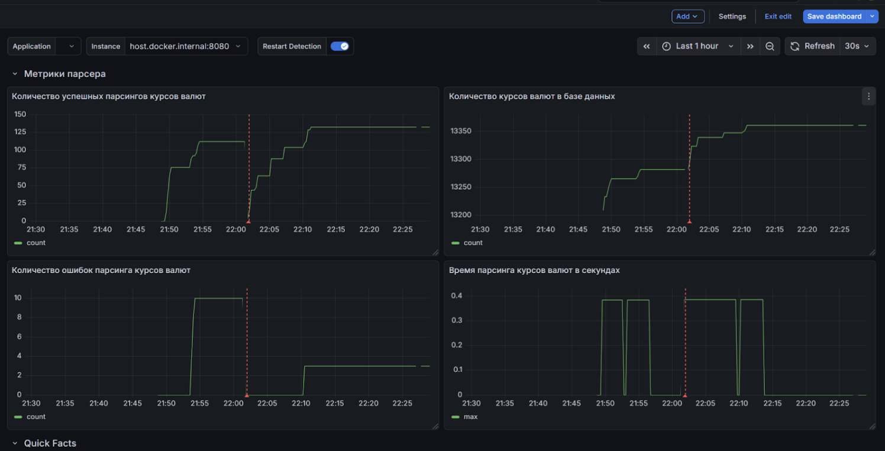

---

## Шаг 2. Профилирование и диагностика с VisualVM

### Настройка VisualVM
Установил **VisualVM** для мониторинга моего Java-приложения и сбора данных о производительности.

### Поиск узких мест
- **Медленные методы**: исследовал методы с длительным временем выполнения, чтобы определить узкие места.
- **Частые сборки мусора (GC)**: Я проанализировал, как часто происходят сборки и что их вызывает.
- **Нагрузка на процессор**: Я определил методы, использующие наибольшее количество ресурсов CPU.

### Работа с Thread Dumps и Heap Dumps
- **Thread Dumps**: использовал для анализа состояния потоков в приложении. Явных проблем с потоками не было обнаружено.
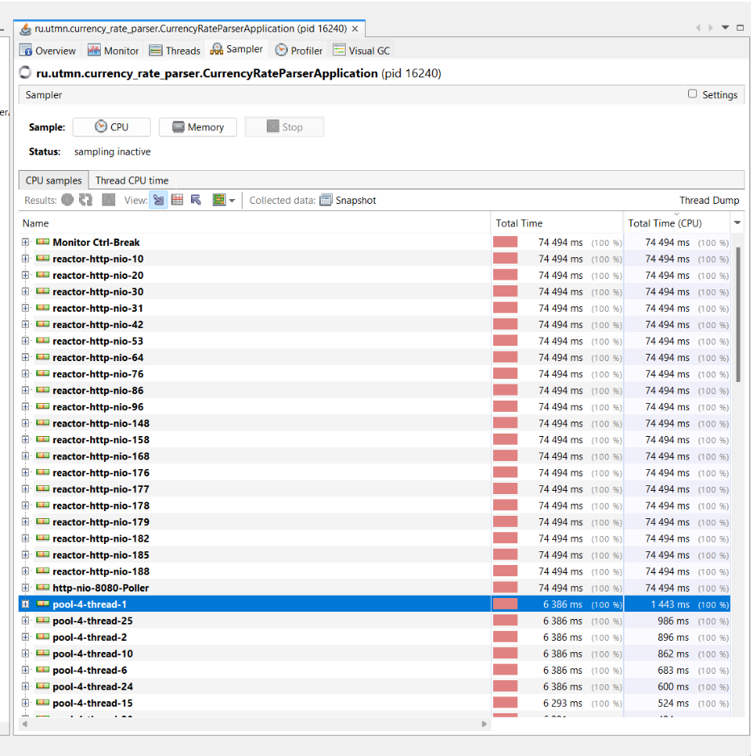

- **Heap Dumps**: изучил активные объекты, чтобы выяснить, какие из них занимаются больше всего памяти. Явных проблем с потреблением памяти не было обнаружено. Память эффективно очищается.
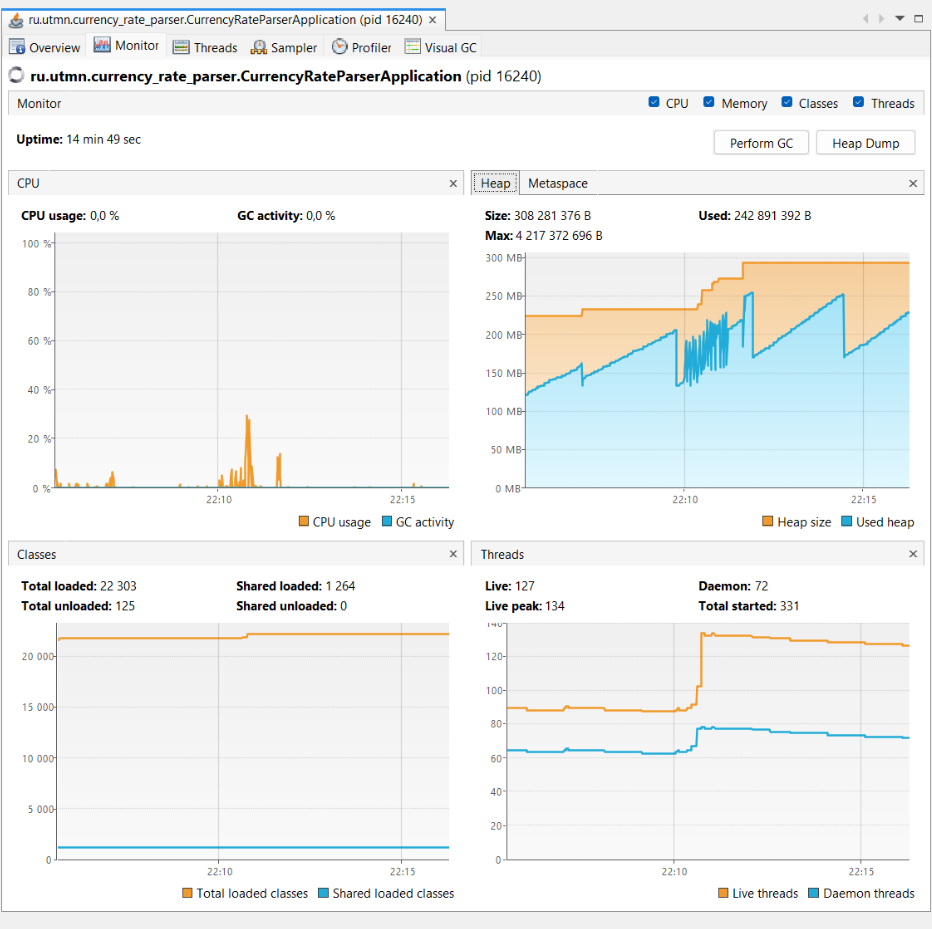
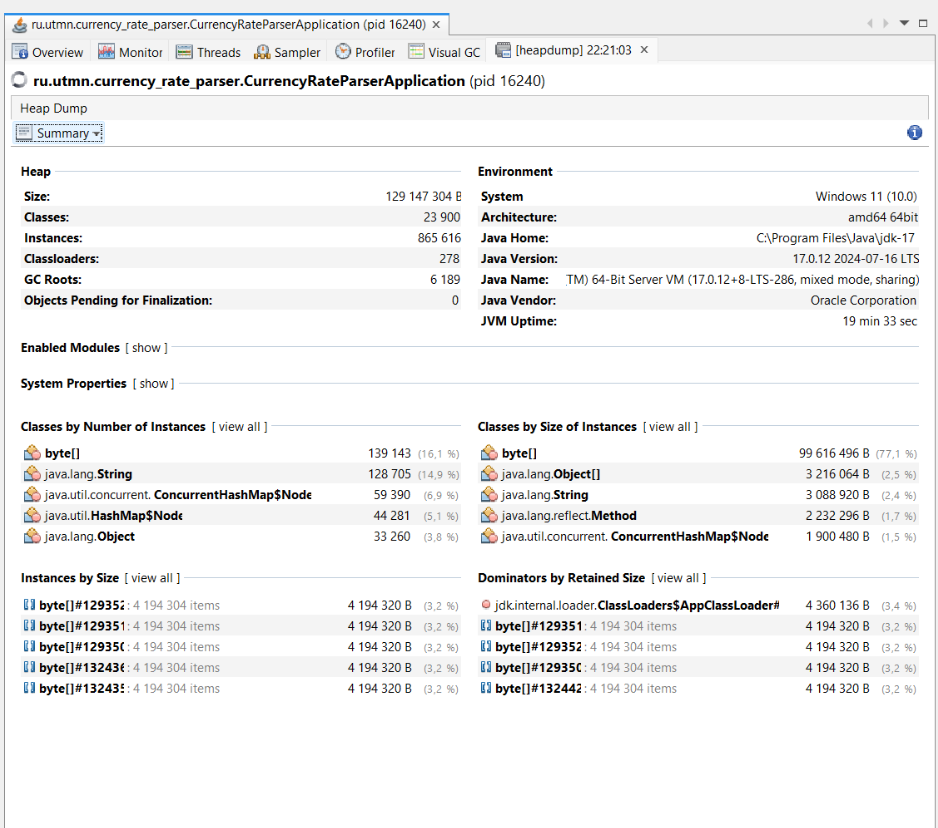

### Нагрузочное тестирование с помощью JMeter
Благодаря нагрузочному тестированию выяснил, как использовать пагинацию и ограничения на количество запрашиваемых данных за 1 раз для увеличения производительности сервиса.
Также заметил узкие места и оптимизировал их позже. Например, заменил синхронный парсинг курсов валют для 1 криптовалюты на асинхронные запросы. Увидел большое количество лишних запросов к БД и оптимизировал их.


- api/v1/currency-rates/get-all?page=0&size=1000
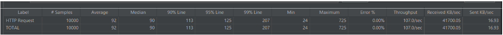
  При сокращении size до разумных пределов, например 100, пропускная способность существенно возрастает.
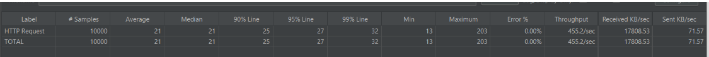

- api/v1/currency-rates/get-all-currency?page=0&size=10000&sortBy=coinMarketCapId&sortDir=desc
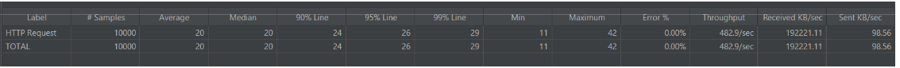
  При сокращении size до разумных пределов, например 1000, пропускная способность существенно возрастает.
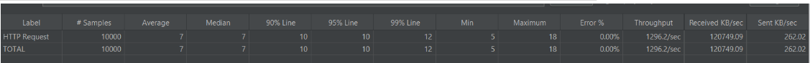

- api/v1/currency-rates/parse
  - Уже были в базе данные
  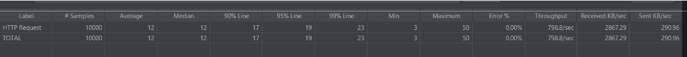
  - Данных в базе еще нет, но позже после скачивания, данные отдаются уже из базы
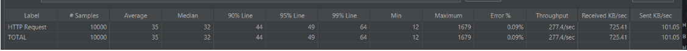
---

## Шаг 3. Анализ управления памятью и GC

### Изучение влияния парсинга на сборку мусора
Измерил, насколько объем создаваемых объектов во время парсинга влияет на частоту GC.
Объекты быстро создаются и удаляются. Утечек памяти нет.


### Частота вызова GC
Выяснил, как часто вызывается сборка мусора и визуализировал это с помощью **VisualVM** и Grafana.
Судя по метрикам с частотой вызова GC все хорошо.
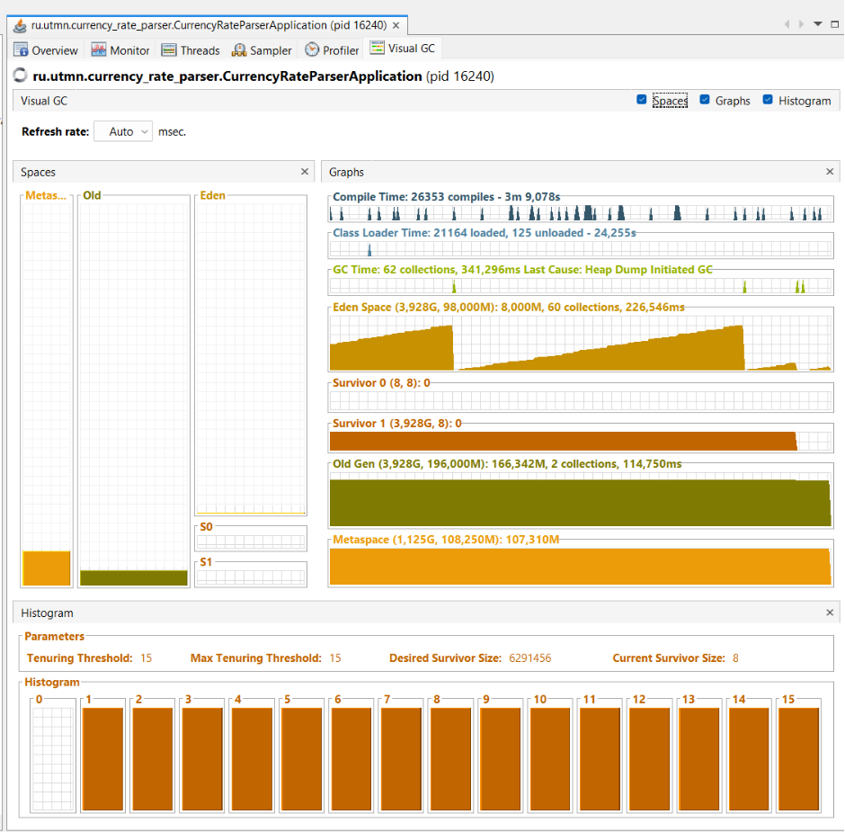
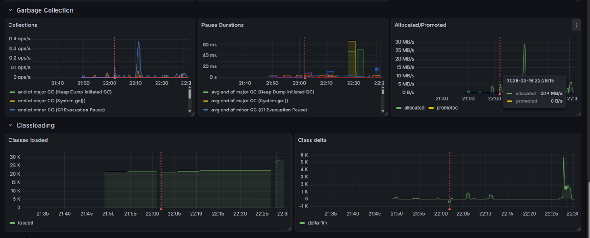

### Объекты, занимающие больше всего памяти
Определил объекты, которые занимают наибольшее количество памяти, чтобы оптимизировать их использование.

Поскольку в дамп попали компоненты сетевого стека и БД, но явных доминирующих объектов, связанных с парсингом нет в топе списка, это может означать, что мои объекты связанные с парсингом быстро создаются, используются и сразу удаляются GC. Явных проблема с памятью нет.

---

## Шаг 4. Поиск и исправление деградации производительности

### Исправление проблем
- **N+1 запросы**
  - Оптимизировал запросы к БД с помощью JPQL. Теперь вместо нескольких сотен запросов к базе по каждой валюте делается 1 для сбора всей информации в методе findByCurrencySymbolsAndCurrencyRateDate при запросе информации по актуальным курсам валют за сегодняшний день.
  - С помощью `@ManyToOne(fetch = FetchType.LAZY)` Убрал N+1 запросы при парсинге курсов валют за определенный день.

- **Отсутствие индексов**
  - Добавил индексы для оптимизации времени выполнения запросов к БД для полей
    currencyRateDate в таблице сurrency_rate и currencySymbol в таблице сurrency

- **Синхронизация потоков**
  - Добавил ReentrantLock на название конкретной криптовалюты с помощью компонента CurrencyLockManager для синхронизации работы потоков при сохранении информации о курсах валют в currencyRateRepository

- **Прочие улучшения**
  - Удалил лишний ExecutorService из CurrencyRateParserService, чтобы не занимал ресурсы
  - Снизил время ожидания ответа от источника с 15 до 5 секунд. Обычно источник отвечает быстрее. Это существенно ускорило обработку запросов на парсинг 
  - Заменил синхронные запросы на асинхронные при запросе курсов за определенный день по конкретной валюте.

---

## Шаг 5. Настройка OpenTelemetry для трейсинга

### Логирование времени для каждого этапа парсинга
Настроил OpenTelemetry для создания трассировок на каждом этапе парсинга, логируя начало и конец каждого запроса.

Интегрировал Jaeger в приложение для сбора и визуализации трассировок, чтобы увидеть, как именно выполняются запросы.

Использовал Jaeger для визуального анализа производительности и выявления узких мест в системе.

Пытался сделать единый trace от начала зароса в ручку до получения результата с дочерними спанами, но не получилось(

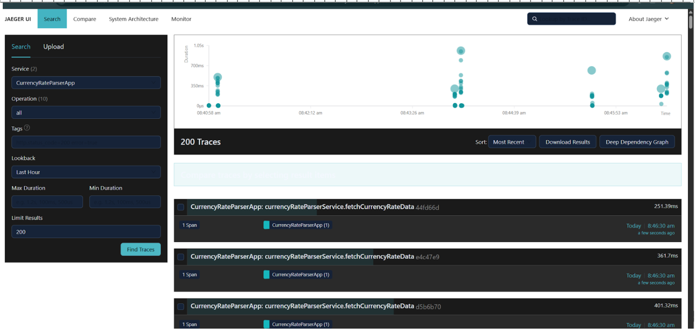
- /api/v1/currency-rates/parse
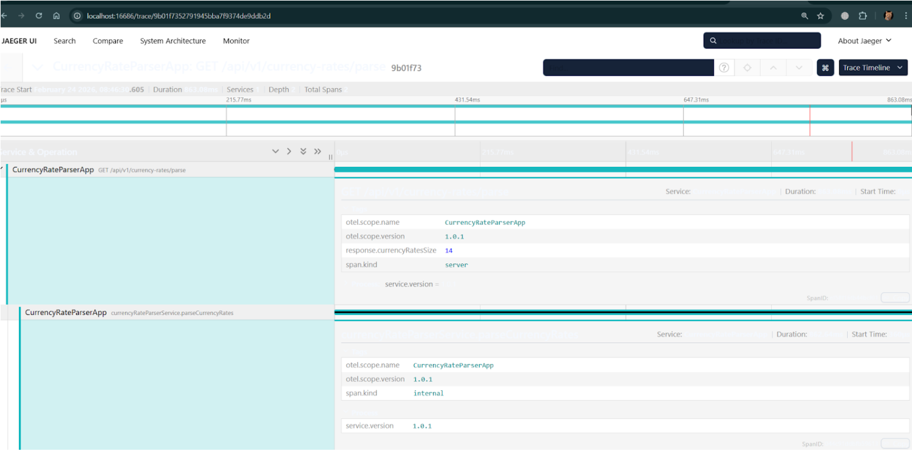

- /api/v1/currency-rates/get-all
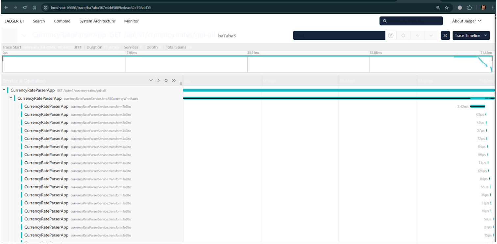

- /api/v1/currency-rates/get-all-currency
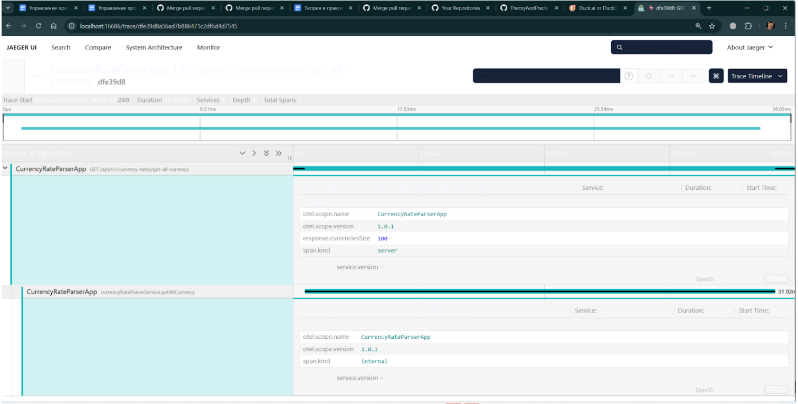

---
